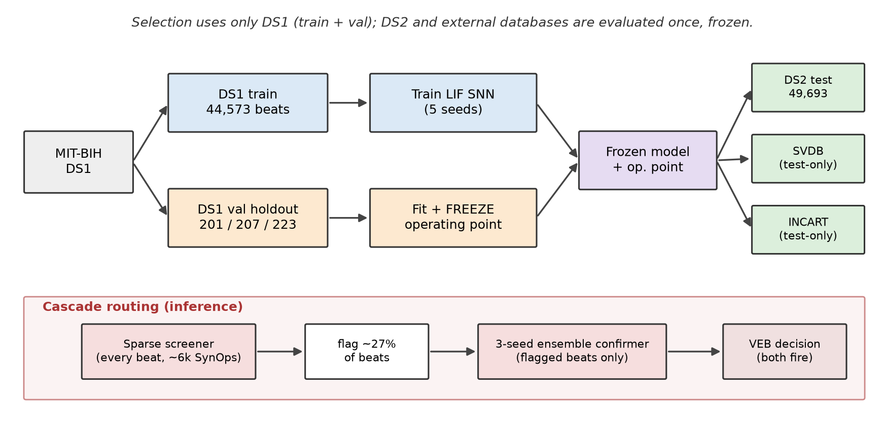
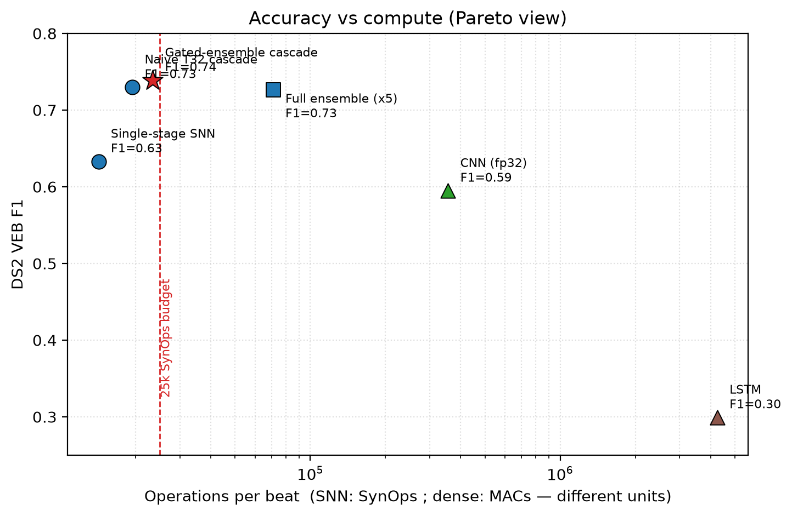
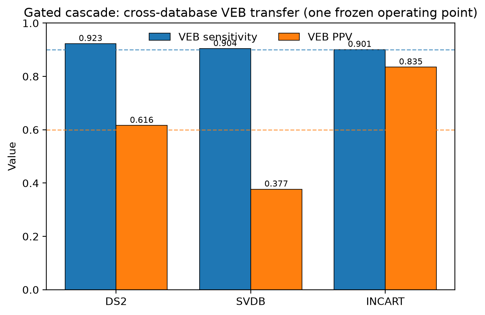

*Contact:* github.com/Talch87/neuro-beat &nbsp;·&nbsp; *Code, weights, live dashboard:* talch87.github.io/neuro-beat

*Status: preprint draft. All quantitative results are from locked runs (operating
points fit only on a DS1 validation holdout; DS2 and external databases frozen).
Author lists for the four references marked † are pending confirmation against the
source.*

---

## Abstract

**Problem.** Spiking neural networks (SNNs) are of interest for always-on cardiac
monitoring because event-driven computation maps onto low-power neuromorphic
hardware. However, a large fraction of the SNN-ECG literature reports accuracy
under evaluation protocols that inflate it, chiefly intra-patient data splits and
decision thresholds selected on the test set, and rarely reports the per-inference
compute that motivates the spiking approach.

**Approach.** We present NeuroBeat, a deliberately simple leaky-integrate-and-fire
(LIF) network for ventricular ectopic beat (VEB) detection, and evaluate it under
a conservative protocol: a patient-disjoint inter-patient split (MIT-BIH DS1 to
DS2), an operating point fit only on a DS1 validation holdout and then frozen for
all test data, an explicit per-beat synaptic-operation (SynOps) budget, and frozen
cross-database testing on two external databases.

**Result.** A single operating point trades sensitivity against precision (VEB
sensitivity 0.894 at positive predictive value (PPV) 0.490, or 0.857 at 0.679,
not both), which we attribute to calibration variance under a small validation
holdout rather than to model capacity. A two-stage gated-ensemble cascade, in
which a sparse high-recall screener (5,987 SynOps/beat) gates a three-seed
ensemble confirmer that runs only on the roughly 27% of beats it flags, reaches
VEB sensitivity 0.923 at PPV 0.616 on DS2 within 23,385 SynOps/beat, and holds VEB
sensitivity at or above 0.90 across DS2, SVDB, and INCART under one frozen operating
point. On DS2 a patient-level bootstrap over the 22 records gives wide intervals
(sensitivity 0.850 to 0.976, PPV 0.355 to 0.814), which we report as the honest
uncertainty for a 22-patient test set.

**Limitations and relevance.** SynOps is a compute proxy, not measured hardware
energy. Supraventricular (SVEB) detection on a single lead is not achievable at
usable precision in this setup and we report it as a negative result. The
contribution is not a new architecture but a validation-locked, energy-accounted
evaluation pattern and a cascade that improves the sensitivity/PPV/energy
tradeoff. This positions the method as a candidate low-power VEB screening
component for wearable or Holter-style monitoring, not as a diagnostic system.

---

## 1. Introduction

Long-term ambulatory ECG is increasingly recorded by wearable and patch devices
that must operate for days on a small battery. Ventricular ectopic beats are
clinically meaningful: their frequency and patterning (for example couplets and
non-sustained ventricular runs) are used in risk stratification, and reliable beat
labelling underpins Holter reporting. A detector intended for continuous,
on-device operation therefore has two coupled requirements: it must be sensitive,
because missed ventricular beats are the costly error, and it must be inexpensive
per beat, because energy determines battery life and thermal envelope.

Spiking networks are a candidate for this regime. They compute with sparse binary
events, and on neuromorphic substrates the dominant cost is the number of synaptic
operations actually triggered by spikes rather than a fixed clocked cost per
layer. This has motivated a body of SNN-ECG work. Our reading of that literature,
consistent with a recent systematic review [Silva2025], is that two recurring
issues limit how far its accuracy numbers can be trusted for deployment.

First, evaluation is frequently optimistic. Under an intra-patient split, beats
from the same patient appear in both training and test sets, so the model can
exploit patient-specific morphology that a device deployed on a new patient never
observes; reported accuracy then overstates real inter-patient performance.
Separately, selecting the decision threshold (or per-class bias) on the test set
leaks label information that is unavailable at deployment time, again inflating the
headline metric. Neither practice is exotic; both are common enough that
cross-study comparison is unreliable [Silva2025].

Second, energy is usually not accounted for. The stated reason to use an SNN is
efficiency, yet many reports give only accuracy or parameter counts, with no
per-inference operation budget against which efficiency could be judged.

The contribution of this paper is therefore not a novel architecture. The network
is intentionally small and conventional. The contribution is evaluation discipline
and an energy-accounted deployment framing: an operating point that is locked on
validation data and never touched on test data, an explicit SynOps budget applied
to every configuration, frozen cross-database testing, and a gated cascade that
improves the sensitivity/PPV/energy tradeoff within that budget. We also report,
rather than hide, a clear negative result for supraventricular beats on a single
lead.

**Contributions.**

1. **A validation-locked inter-patient protocol.** We adopt the de Chazal DS1/DS2
   patient-disjoint split [deChazal2004], hold out three DS1 records as a
   patient-disjoint validation set, fit the operating point only on that holdout,
   and freeze it for DS2 and all external data. No reported test number
   participates in selecting the operating point on the split it is reported on
   (Section 6).
2. **An explicit per-beat SynOps budget.** We define a per-beat synaptic-operation
   count (Section 5.4), report it for every configuration, and hold each to a fixed
   25,000 SynOps/beat budget.
3. **Frozen cross-database validation.** The single frozen operating point is
   applied unchanged to two databases the model never trained on (SVDB, INCART),
   quantifying transfer under distribution shift.
4. **A gated-ensemble cascade within budget.** A sparse screener on every beat
   gates a small ensemble confirmer on flagged beats, reaching VEB sensitivity
   0.923 at PPV 0.616 within 23,385 SynOps/beat, which no single-stage model in our
   sweep achieves.
5. **A negative result for single-lead SVEB.** Under the same protocol, single-lead
   supraventricular detection does not reach usable precision, and we document why
   and how it fails rather than tuning it to a misleading number.

---

## 2. Related Work

**(a) ECG arrhythmia classification and inter-patient evaluation.** The ANSI/AAMI
EC57 standard [AAMI-EC57] defines the five heartbeat classes and the
sensitivity/PPV reporting convention used throughout this literature. de Chazal et
al. [deChazal2004] introduced the patient-disjoint DS1/DS2 partition of the 44
non-paced MIT-BIH records (about 50,000 beats per set) that has become the
reference inter-patient benchmark. Many subsequent methods report higher raw
accuracy than we do, but a substantial share do so under intra-patient splits or
with test-set-selected thresholds; the systematic review of Silva et al.
[Silva2025] documents that few studies simultaneously satisfy inter-patient
partitioning, AAMI compliance, and embedded feasibility. We do not claim to beat
the strongest reported numbers on raw accuracy; we claim comparability under a
stricter, leakage-controlled protocol with an energy budget.

**(b) Low-power and embedded ECG inference.** A parallel line of work targets
resource-constrained deployment through quantized and compact convolutional or
temporal-convolutional models, pruning, and microcontroller implementations. These
approaches report MACs, memory footprint, or measured microcontroller energy.
They are the natural non-spiking comparison point for efficiency claims; we include
convolutional and recurrent baselines here (Section 7.5) and note quantized CNN and
temporal-convolutional baselines as needed additional comparisons (Section 9).

**(c) Spiking and neuromorphic ECG.** SNN-ECG methods report competitive MIT-BIH
accuracy using delta-modulation encoding of the ECG and its derivatives
[SNN-ECG-BSPC2021], spike-driven processors for wearable ECG [Chu2022],
hardware/software co-design [SparrowSNN2024], and axonal-delay models
[AxonalDelays2025]. Our count-pooled delta encoding over signal orders is in this
family. We differ in evaluation rather than in mechanism: we report validation-
locked inter-patient results with an explicit SynOps budget, frozen cross-database
transfer, and a documented single-lead SVEB failure.

**(d) Cascaded and gated inference.** Two-stage screener/confirmer and
energy-gated designs are established elsewhere for trading average compute against
accuracy. We use the pattern narrowly: to make an ensemble-grade confirmer
affordable on average by invoking it only on candidates a cheap screener flags.

**(e) Evaluation hygiene and reproducibility.** Our protocol choices follow the
recommendations surveyed in [Silva2025]. We additionally release code, frozen
weights, per-seed logs, and a public results page so that every reported number is
regenerable.

---

## 3. Data

**MIT-BIH Arrhythmia Database (primary).** 48 two-lead ambulatory records sampled
at 360 Hz. Annotated beats are mapped to the five AAMI classes: N (normal), S
(supraventricular ectopic, SVEB), V (ventricular ectopic, VEB), F (fusion of
normal and ventricular), and Q (unknown/paced). We use the de Chazal
patient-disjoint split [deChazal2004]: DS1 for training and DS2 for test, with no
patient in both. From DS1 we hold out records 201, 207, and 223 as a
patient-disjoint validation set used only for operating-point selection. Beat
counts are given in Table 1.

**External databases (test-only).** The MIT-BIH Supraventricular Arrhythmia
Database (SVDB, 128 Hz) and the St. Petersburg INCART 12-lead Arrhythmia Database
(INCART, 257 Hz). These are used exclusively for frozen cross-database testing;
no external beat enters training or operating-point selection for the VEB models.

**Preprocessing and resampling.** External signals are resampled to 360 Hz with
polyphase resampling (`scipy.signal.resample_poly`, applied to the ratio reduced
by its greatest common divisor), and annotation sample indices are rescaled by the
same factor. Lead selection is fixed a priori: MIT-BIH and SVDB use lead 0; INCART
uses lead II (index 1). We apply no per-record adaptive filtering or denoising
beyond resampling, so that the reported transfer reflects the raw morphology
difference across databases.

**Beat segmentation and RR features.** Each beat is a fixed window of 256 samples
(about 0.71 s at 360 Hz) centred on the annotated R-peak; we use provided
annotations and do not run a separate detector, so results are conditional on
accurate R-peak locations (Section 9). For each beat we compute three RR-interval
features (previous RR, following RR, and their ratio). RR features are standardized
using training-set statistics only, and the same statistics are applied unchanged
to validation, test, and external data.

**Table 1. Beat counts by class (after segmentation).**

| Split | Total | N | SVEB (S) | VEB (V) | F | Q |
|---|---:|---:|---:|---:|---:|---:|
| DS1 train | 44,573 | 38,113 | 673 | 3,255 | 2,526 | 6 |
| DS1 val (201/207/223) | 6,427 | 5,222 | 308 | 881 | 16 | 0 |
| DS2 test | 49,693 | 44,241 | 1,837 | 3,220 | 388 | 7 |
| SVDB (external) | 184,520 | 162,281 | 12,196 | 9,941 | 23 | 79 |
| INCART (external) | 175,811 | 153,621 | 1,959 | 20,006 | 219 | 6 |

*(DS1 train class counts are from the same segmentation pipeline; the VEB and SVEB
minorities are the quantities that matter for the class-weighted objective.)*

---

## 4. Figures

Figures 1, 3, and 4 are rendered from the locked results and included below
(sources in `paper/figures/`). Figures 2 and 5 are specified for the camera-ready
version; their underlying numbers are already reported in Section 7.

**Figure 1 (protocol / no-leakage).** DS1 is split into a training set and a
patient-disjoint validation holdout (records 201, 207, 223). The operating point is
selected only on the validation holdout and then frozen. The frozen model is
applied once to DS2 and, unchanged, to the external SVDB and INCART databases. The
lower band shows cascade routing at inference (sparse screener on every beat;
ensemble confirmer only on flagged beats). *Message: no test or external data
participates in model or threshold selection.*

**Figure 3 (accuracy-energy Pareto).** DS2 VEB F1 versus operations per beat, log
scale. SNN points are SynOps; CNN and LSTM are MACs, a different operation unit, and
are marked as such. The 25k-SynOps budget is drawn as a reference line for the SNN
points. *Message: the gated ensemble occupies the within-budget corner; the full
ensemble is more accurate but over budget; the dense baselines sit orders of
magnitude higher in operation count.*

**Figure 4 (cross-database transfer).** VEB sensitivity and PPV for the frozen gated
cascade on DS2, SVDB, and INCART, with the 0.90 and 0.60 target lines. *Message:
sensitivity transfers (>= 0.90 on all three databases under one frozen operating
point); PPV varies with class prevalence.*

**Figure 2 (single-stage sensitivity/PPV frontier; to render).** DS2 VEB PPV as a
function of sensitivity for single-stage models, one curve per seed, with the three
named operating points marked. *Message: a single operating point cannot reach both
sensitivity >= 0.90 and PPV >= 0.60 reliably across seeds.*

**Figure 5 (SVEB negative result; to render).** DS2 SVEB sensitivity versus PPV per
seed for the SVEB specialist, contrasted with the same architecture's SVEB
sensitivity on 12-lead INCART. *Message: single-lead SVEB is unstable and
low-precision; the same model separates SVEB far better with more lead information.*

---

## 5. Methods

### 5.1 Spike encoding

Each 256-sample beat window is converted to a spike tensor by count-pooled delta
encoding. For each signal order in the set `orders` (order 0 is the signal, order 1
its first difference), threshold crossings of magnitude theta = 0.12 (in
normalized signal units) are accumulated into T time bins, producing two channels
(rising and falling crossings) per order. With `orders = [0, 1]` this yields
2 x |orders| = 4 input channels over T timesteps. Because crossings are pooled by
count into bins, the total number of input spikes over a beat is approximately
conserved as T varies; increasing T redistributes the same spikes into finer bins
rather than creating more of them (Section 8).

### 5.2 Network

The classifier is a two-layer LIF network. A linear map `fc1` projects the 4 input
channels to H = 128 hidden LIF units; a linear map `fc2` projects hidden spikes to
5 class logits. The three RR features are projected once, through a separate dense
map, into the hidden state (they are not re-injected at every timestep). The
readout accumulates the output-layer membrane potential over T timesteps. Training
uses surrogate-gradient backpropagation-through-time (snnTorch [Eshraghian2023],
following [Neftci2019]) with the Adam optimizer, learning rate 4e-3, 100 epochs,
batch size 512, and class weights scaled as the square root of inverse class
frequency to counter imbalance. Unless stated otherwise the single-stage model uses
T = 64.

### 5.3 Operating point selection

The network emits 5 logits; the decision adds a fixed per-class bias vector
`b = [0, b_S, b_V, b_F, b_Q]` and takes the argmax, with `b_F` and `b_Q` set to a
large negative constant so that fusion and unknown are never predicted (their
support in DS1 is too small to calibrate). The two free parameters `(b_S, b_V)` are
selected by grid search on the validation holdout only, and then frozen. We define
three selection strategies:

- **sens-first:** maximize validation VEB PPV subject to validation VEB
  sensitivity >= 0.90;
- **ppv-first:** maximize validation VEB sensitivity subject to validation VEB
  PPV >= 0.60;
- **balanced:** maximize validation VEB F1.

When a strategy's constraint is infeasible on validation for a given seed, we
report that seed as infeasible rather than substituting a degenerate maximum-
sensitivity point. The single-stage NeuroBeat-VEB uses sens-first, because missing
ventricular beats is the more costly error; we also report the full frontier so the
tradeoff is explicit.

### 5.4 Energy proxy: SynOps per beat

We report a per-beat synaptic-operation count, defined as the number of accumulate
operations triggered by spikes across the forward pass:

`SynOps = (sum over T of input_spikes) * H + (sum over T of hidden_spikes) * C + n_RR * H`,

where H = 128, C = 5, n_RR = 3, and `input_spikes` / `hidden_spikes` are the
per-timestep active-unit counts. The first term (input to hidden) dominates and is
encoding-dependent, which is why sparse, low-order input matters more than T. This
proxy counts the accumulate operations a neuromorphic core performs; it excludes
membrane-state updates, on-chip memory movement, the encoding and sensor front
end, and any host overhead. It is therefore a compute proxy and not a measured
energy figure (Sections 8 and 9). The budget throughout is 25,000 SynOps/beat.

### 5.5 Two-stage gated-ensemble cascade

A single model cannot reach both target thresholds at one operating point
(Section 7.1). We therefore route inference through two stages:

- **Screener (every beat).** A deliberately sparse LIF network (T = 32, H = 64,
  encoding threshold 0.18, `orders = [0, 1]`), with its operating point fit on
  validation for high VEB recall. Its sparsity, not its shorter T, is what makes it
  cheap (Section 8): higher threshold and fewer hidden units reduce spike counts,
  whereas reducing T alone would not (Section 5.1).
- **Confirmer (flagged beats only).** A three-seed ensemble of the T = 64 models
  already trained for the single-stage study, combined by logit averaging. It runs
  only on beats the screener flags. A beat is declared VEB if and only if both the
  screener and the ensemble confirmer fire.

Both operating points are fit on validation only (screener recall target 0.97;
confirmer maximizes cascade VEB PPV subject to cascade VEB sensitivity >= 0.90 on
validation), then frozen. Average energy is

`SynOps(screener) + flag_rate * K * SynOps(one confirmer member on flagged beats)`,

with K = 3. Because the flag rate is small, the heavier confirmer contributes
little on average. The confirmer members' SynOps are measured on the flagged
(ectopic-enriched) beats, which are more active and therefore more expensive per
beat than an average DS2 beat; we use that higher figure rather than the DS2-wide
average, so the reported energy is not optimistic.

### 5.6 Seeds and model selection

Each configuration is trained with 5 seeds. For the single-stage frozen artifact,
the seed is chosen by validation VEB F1 among seeds that satisfy the sens-first
validation constraint, never by any DS2 or external number. For the cascade, the
confirmer uses seeds 0 to 2; we report robustness to this choice in Section 7.3.

---

## 6. Evaluation protocol (no-leakage statement)

To make the leakage-control claim unambiguous:

1. DS2 is never used for model selection, hyperparameter selection, threshold
   selection, seed selection, or early stopping. It is evaluated once, with a
   frozen model and a frozen operating point.
2. All operating points (single-stage and both cascade stages) are selected only on
   the DS1 validation holdout (records 201, 207, 223), which is patient-disjoint
   from DS1 training.
3. SVDB and INCART are test-only. No external beat enters training or operating-
   point selection for the VEB models. Every cross-database number uses the same
   frozen operating point selected on DS1 validation.
4. All reported final numbers were produced by evaluating locked artifacts; no
   number was revised after seeing test performance.

The one deliberate exception is the SVEB specialist (Section 7.6), which by design
adds SVDB and INCART beats to training as an augmentation study; its DS2 test set
remains untouched, and we flag its non-standard training explicitly.

---

## 7. Results

All results use 5 training seeds. We report seed mean with [min, max] where a
distribution exists, and 95% bootstrap confidence intervals (2,000 resamples over
DS2 beats) for the headline cascade. DS2 contains 3,220 VEB beats out of 49,693
(Table 1), so a one-point change in sensitivity corresponds to about 32 beats.

### 7.1 Single-stage VEB detection

DS2 VEB detection under each validation-fit strategy (5 seeds), with SynOps/beat:

| Operating point | VEB sensitivity | VEB PPV | F1 | SynOps/beat |
|---|---|---|---|---|
| sens-first | 0.905 [0.878, 0.928] | 0.539 [0.490, 0.627] | 0.68 | ~14,300 |
| balanced | 0.857 [0.790, 0.912] | 0.679 [0.517, 0.780] | 0.76 | ~14,300 |
| ppv-first | 0.845 [0.771, 0.888] | 0.700 [0.583, 0.791] | 0.77 | ~14,300 |

A single operating point buys sensitivity or precision, not both: at sensitivity
near 0.90 the PPV is about 0.54, and reaching PPV near 0.68 costs roughly 4 to 7
points of sensitivity. All single-stage configurations sit under the SynOps budget.
Note that the balanced point has a higher F1 (0.76) than the cascade below (0.74):
the cascade is not F1-optimal, it is selected to satisfy both clinical thresholds
(sensitivity >= 0.90 and PPV >= 0.60) jointly, which the balanced point does not
(its sensitivity is 0.857).

**Frontier (Figure 2).** Sweeping the VEB decision threshold on DS2 (an oracle
sweep, shown only to characterize what is achievable, not as an operating point),
the DS2 VEB PPV attainable at each sensitivity level spans, across the 5 seeds:

| Sensitivity >= | 0.80 | 0.85 | 0.90 | 0.92 |
|---|---|---|---|---|
| VEB PPV (range) | 0.57 to 0.78 | 0.57 to 0.69 | 0.56 to 0.65 | 0.48 to 0.57 |

Two of the five seeds cannot exceed 0.90 sensitivity on DS2 even at the oracle
threshold, and no seed offers a single point at both sensitivity >= 0.90 and PPV
>= 0.60 with margin. This motivates the cascade.

### 7.2 Cross-database generalization (single-stage)

The frozen single-stage model (sens-first, fit on DS1 validation) applied unchanged:

| Database | Beats | VEB beats | VEB sensitivity | VEB PPV |
|---|---:|---:|---|---|
| MIT-BIH DS2 | 49,693 | 3,220 | 0.894 | 0.490 |
| MIT-BIH SVDB | 184,520 | 9,941 | 0.892 | 0.361 |
| INCART | 175,811 | 20,006 | 0.880 | 0.736 |

VEB sensitivity holds in a narrow band (0.88 to 0.89) across three databases with
different patients, leads, and original sampling rates, under one frozen operating
point. PPV varies with class prevalence: it is lower on the supraventricular-dense
SVDB (more non-VEB beats resembling VEB) and higher on the VEB-dense INCART. This
is the expected behaviour of a fixed threshold under prevalence shift and is why we
report sensitivity and PPV separately rather than a single accuracy figure.

### 7.3 Two-stage gated-ensemble cascade

The frozen cascade (screener recall target 0.97; confirmer fit for cascade
PPV subject to cascade sensitivity >= 0.90; both on validation only):

| Database | Beats | VEB beats | VEB sensitivity | VEB PPV | Flag rate |
|---|---:|---:|---|---|---|
| MIT-BIH DS2 | 49,693 | 3,220 | 0.923 | 0.616 | 0.271 |
| MIT-BIH SVDB | 184,520 | 9,941 | 0.904 | 0.377 | 0.345 |
| INCART | 175,811 | 20,006 | 0.901 | 0.835 | 0.241 |

We report two bootstrap intervals for the DS2 point estimates. A beat-level
bootstrap (resampling beats independently, 2,000 resamples) gives sensitivity
[0.914, 0.932] and PPV [0.602, 0.630]. A patient-level bootstrap (resampling the 22
DS2 records with replacement, which respects within-record correlation) gives much
wider intervals: sensitivity [0.850, 0.976] and PPV [0.355, 0.814]. The gap between
the two is large because VEB beats are concentrated in a minority of records, so a
few patients dominate the estimate. The patient-level interval is the honest one to
quote: the point estimates meet the targets on DS2's specific patient composition,
but per-patient behaviour varies substantially, and a wider prospective evaluation
would be needed to tighten this. Average energy on DS2 is
`5,987 + 0.271 * 3 * 21,433 = 23,385` SynOps/beat, within the 25,000 budget.
Robustness to the confirmer composition: ensembles of K in {2, 3, 5} members and
different 3-member subsets all give DS2 sensitivity >= 0.90 at PPV between 0.59 and
0.64.

### 7.4 Accuracy-energy Pareto (Figure 3)

| Model | DS2 sens / PPV | Compute/beat |
|---|---|---|
| Single-stage (sens-first) | 0.894 / 0.490 | 14,200 SynOps |
| Naive T32 cascade | 0.883 / 0.622 | 19,400 SynOps |
| Full 5-seed ensemble (every beat) | 0.932 / 0.595 | ~71,000 SynOps |
| Gated-ensemble cascade | 0.923 / 0.616 | 23,385 SynOps |

The full ensemble reaches the target corner but costs about five forward passes and
exceeds the budget. The gated cascade recovers most of that accuracy within budget
by running the ensemble only on flagged beats. The naive T32 cascade is a
cautionary point: it costs more than the single-stage model, because a shorter
network is not a cheaper one under count-pooled encoding (Section 8).

### 7.5 Non-spiking baselines on the same split

We train 1-D CNN and LSTM baselines under the identical protocol: same DS1 train,
same beat-plus-RR inputs, same validation-locked sens-first operating point, same
frozen DS2 test, 5 seeds.

| Model | DS2 sens | DS2 PPV | Operations/beat | Params |
|---|---|---|---|---|
| CNN (1-D, beat+RR) | 0.945 [0.926, 0.959] | 0.434 | 356k MACs | 2.9k |
| LSTM (beat+RR) | 0.940 [0.911, 0.974] | 0.178 | 4.26M MACs | 17.5k |
| SNN single-stage | 0.894 | 0.490 | 14.2k SynOps | 18k |
| SNN gated-ensemble | 0.923 | 0.616 | 23.4k SynOps | n/a |

Two observations. First, the dense baselines show the same sensitivity/precision
tradeoff: under the sens-first operating point they reach high sensitivity (about
0.94) but low PPV (0.43 for the CNN, 0.18 for the LSTM), so the tradeoff is a
property of single-lead VEB detection rather than of spiking networks. Second, on
operation count the SNN is far lower: 14k to 23k SynOps versus 356k (CNN) and 4.26M
(LSTM) MACs. We state this carefully. A SynOp (a spike-triggered accumulate) and a
MAC (a multiply-accumulate) are not the same unit, and this comparison is an
operation-count advantage under a proxy model, not a measured energy ratio. The
comparison would be strengthened by quantized CNN and temporal-convolutional
baselines and by measured microcontroller energy (Section 9). Within these caveats,
the gated cascade also attains the highest PPV of any model at comparable
sensitivity.

Post-training int8 weight quantization of the CNN (per-tensor symmetric, weights
only, activations left in float, 3 seeds) preserves DS2 VEB detection: fp32
0.951 / 0.417 versus int8 0.951 / 0.444 (sensitivity / PPV), with weight memory
reduced from 11.6 kB to 3.1 kB. This is the fair embedded operating point for the
dense baseline: the MAC count is unchanged (356k/beat), but an int8 MAC is
materially cheaper and smaller than an fp32 MAC on typical microcontrollers.
Quantization therefore closes part of the compute gap in energy-per-operation terms
without changing the operation count, and a full int8 pipeline (quantized
activations, with calibration) plus measured board energy is the comparison we
recommend for a camera-ready version (Section 9).

### 7.6 Supraventricular beats: a single-lead negative result

Supraventricular ectopic beats often differ from normal beats mainly in timing and
subtle morphology, and DS1 contains few of them (Table 1). As an incidental output
of the VEB model, DS2 SVEB sensitivity is about 0.13; adding supraventricular-rich
SVDB to training raises it to about 0.24, and a higher-time-resolution variant to
about 0.27, all still low.

We then trained a dedicated SVEB specialist (higher time resolution, SVDB and
INCART added to training, an SVEB-first operating point, 5 seeds). It does not yield
a usable detector:

| Seed regime | DS2 SVEB sens | DS2 SVEB PPV | DS2 VEB sens |
|---|---|---|---|
| calibrated (seeds 0 to 2) | 0.16 to 0.27 | 0.07 to 0.15 | degraded |
| degenerate (seeds 3 to 4) | 0.82 to 0.94 | 0.04 to 0.06 | 0.18 to 0.24 |

The high-sensitivity seeds reach it only by flagging almost all beats as SVEB (PPV
at or below 0.06), which collapses the ventricular class. DS2 SVEB PPV never exceeds
about 0.15 at any operating point, and the outcome is unstable across seeds. The
same architecture reaches SVEB sensitivity 0.62 on 12-lead INCART, which indicates
that the limiting factor is available lead information and data rather than model
capacity. We therefore treat single-lead SVEB as an open problem and, importantly,
do not allow it to reshape the VEB operating point. Multi-lead input (MIT-BIH
provides a second lead; supraventricular beats separate better on some leads) and
richer SVEB training data are the natural next steps (Section 9).

---

## 8. Discussion

**(a) Honest evaluation lowers headline numbers but increases trust.** Freezing the
operating point on validation rather than test, and reporting inter-patient rather
than intra-patient results, lowers our headline metrics relative to test-tuned or
intra-patient reports. The compensating evidence is transfer: the same frozen
operating point holds VEB sensitivity at or above 0.90 across three databases,
which a test-tuned threshold cannot promise. We regard the frozen cross-database
result as the most decision-relevant number in the paper.

**(b) Energy-accounted models need explicit budgets.** Reporting SynOps for every
configuration, and enforcing a fixed budget, changes which design choices look
attractive. It is what exposes the naive cascade as a false economy and the full
ensemble as over budget, and it is what makes the sparse-screener design necessary
rather than incidental.

**(c) Time resolution is not the same as energy cost under count-pooled encoding.**
Because count-pooling approximately conserves total input spikes across T, the
dominant SynOps term is roughly independent of T. Two consequences follow: raising T
sharpens discrimination at almost no energy cost, and a shorter network is not a
cheaper one. A screener must be made cheap by reducing channels, hidden units, or
spike rate (via a higher threshold), which is exactly how our screener is built.

**(d) The cascade addresses a calibration-variance limit at low average cost.** The
DS2 oracle frontier shows that sensitivity >= 0.90 at PPV >= 0.60 is attainable, yet
single models calibrated on a small validation holdout land there only
occasionally and vary across seeds. A small ensemble both reduces model variance and
calibrates more stably, reaching 0.918 / 0.634 on DS2 for three members; gating it
behind a sparse screener delivers that accuracy within budget.

**(e) VEB is promising; single-lead SVEB is not solved.** The VEB result is usable
under a strict protocol and an energy budget. The SVEB result is a clean negative
under the same protocol, and we present it as such.

**Alternative explanations we cannot fully exclude.** The cross-database PPV
differences could reflect annotation-convention differences between databases rather
than only prevalence. The single-model seed variance could partly reflect
optimization noise rather than only calibration; the ensemble would help in either
case. We report both beat-level and patient-level bootstrap intervals (Section 7.3);
the patient-level interval is much wider because a few records dominate the DS2 VEB
count, and it is the interval we treat as the honest uncertainty.

---

## 9. Limitations

- **SynOps is a compute proxy, not measured energy.** Actual joules depend on the
  target chip, on-chip and off-chip memory movement, the compiler and runtime, the
  sensor and encoding front end, and the specific implementation. We report no
  measured hardware energy.
- **Retrospective public data only.** All data are curated public research
  databases with expert beat annotations. Performance on raw, artefact-laden
  device recordings is untested.
- **Small validation holdout.** Three DS1 records make single-model operating
  points noisy; the ensemble mitigates but does not remove this. A larger or
  cross-validated holdout is likely to tighten calibration.
- **Detection is conditional on R-peak annotations.** We use provided annotations
  and do not include a beat detector; end-to-end performance would also depend on
  detector errors.
- **Prevalence-dependent PPV.** Cross-database PPV is sensitive to class
  composition, so PPV numbers should be read together with the beat counts.
- **Single lead.** Results use one lead; SVEB in particular appears to need more
  lead information.
- **Large between-patient variance.** With only 22 DS2 patients, a patient-level
  bootstrap gives wide intervals (VEB sensitivity 0.85 to 0.98, PPV 0.36 to 0.81).
  The point estimates hold for DS2's composition, but per-patient behaviour varies
  substantially, so a larger prospective cohort is needed to tighten them.
- **No prospective or clinical-workflow validation, and no subgroup or demographic
  fairness analysis.** Nothing here has been validated in a deployment or against
  regulatory-grade endpoints.

---

## 10. Clinical and commercial relevance

The most credible near-term role for this work is as a low-power VEB screening
component inside a larger pipeline: wearable or patch ECG, Holter-style ambulatory
monitoring, remote patient monitoring, or a neuromorphic edge inference block that
flags ventricular ectopy for downstream review. In such a role, high sensitivity at
a controlled compute budget, with predictable cross-database behaviour, is the
relevant property, and PPV in the 0.6 range is acceptable for a screening stage
that feeds human or higher-tier automated review.

We make no claim of diagnostic readiness. A path to product would require, at
minimum, measured energy on the intended microcontroller or neuromorphic hardware,
prospective validation on device-quality recordings, integration into a clinical
workflow with defined alarm handling, quality-system and software-as-a-medical-
device processes, and a regulatory strategy. The present contribution is a
methodological and feasibility result, not a cleared device.

---

## 11. Conclusion

NeuroBeat shows that a compact, conventional spiking network, evaluated under a
conservative validation-locked inter-patient protocol and held to an explicit
per-beat SynOps budget, can reach useful ventricular-ectopic-beat sensitivity and
precision (0.923 sensitivity at 0.616 PPV on MIT-BIH DS2, within 23,385
SynOps/beat) using a gated-ensemble cascade, while transferring at or above 0.90
sensitivity to two unseen databases under one frozen operating point. The main
contribution is not a new architecture but an honest, energy-accounted evaluation
pattern for low-power ECG detection, together with a clearly reported negative
result for single-lead supraventricular detection. We hope the protocol, the SynOps
budgeting, and the released artifacts are reusable by others reporting SNN-ECG
results.

---

## 12. Reproducibility

- Repository: github.com/Talch87/neuro-beat (AGPL-3.0 / commercial dual license)
- Live results page: talch87.github.io/neuro-beat
- Frozen artifacts: `models/neurobeat-veb-v1/` (single-stage weights and operating
  point, sparse screener, three confirmer members, gated-cascade configuration,
  model card)
- Protocol harnesses: `experiments/freeze_veb_v1.py` (single-stage; `--refit-only`
  re-tunes the operating point from cache), `experiments/gated_ensemble_veb.py`
  (cascade), `experiments/baselines_veb.py` (CNN/LSTM)
- All experiments use 5 seeds with the operating point fit on DS1 validation only.

---

## References

*Compiled and cross-checked via literature search (July 2026). Entries marked †
have verified title, venue, and identifier, but their author lists are not yet
confirmed against the source and must be checked before submission (Section 9 task).*

- **[AAMI-EC57]** ANSI/AAMI EC57. *Testing and Reporting Performance Results of
  Cardiac Rhythm and ST-Segment Measurement Algorithms.* Association for the
  Advancement of Medical Instrumentation.
- **[deChazal2004]** P. de Chazal, M. O'Dwyer, R. B. Reilly. "Automatic
  classification of heartbeats using ECG morphology and heartbeat interval
  features." *IEEE Trans. Biomed. Eng.*, 51(7):1196 to 1206, 2004.
  doi:10.1109/TBME.2004.827359.
- **[Silva2025]** G. Silva, P. Silva, G. Moreira, V. Freitas, J. Gertrudes,
  E. Luz. "A Systematic Review of ECG Arrhythmia Classification: Adherence to
  Standards, Fair Evaluation, and Embedded Feasibility." arXiv:2503.07276, 2025.
- **[Moody2001]** G. B. Moody, R. G. Mark. "The impact of the MIT-BIH Arrhythmia
  Database." *IEEE Eng. Med. Biol. Mag.*, 20(3):45 to 50, 2001.
- **[Goldberger2000]** A. L. Goldberger et al. "PhysioBank, PhysioToolkit, and
  PhysioNet." *Circulation*, 101(23):e215 to e220, 2000.
- **[Neftci2019]** E. O. Neftci, H. Mostafa, F. Zenke. "Surrogate Gradient
  Learning in Spiking Neural Networks." *IEEE Signal Process. Mag.*,
  36(6):51 to 63, 2019.
- **[Eshraghian2023]** J. K. Eshraghian et al. "Training Spiking Neural Networks
  Using Lessons From Deep Learning." *Proc. IEEE*, 111(9):1016 to 1054, 2023.
- **[Davies2018]** M. Davies et al. "Loihi: A Neuromorphic Manycore Processor
  with On-Chip Learning." *IEEE Micro*, 38(1):82 to 99, 2018.
- **[SNN-ECG-BSPC2021]** † "Energy efficient ECG classification with spiking
  neural network." *Biomed. Signal Process. Control*, 2021.
  (ScienceDirect S1746809420303098; authors to confirm.)
- **[Chu2022]** † "A Neuromorphic Processing System With Spike-Driven SNN
  Processor for Wearable ECG Classification." *IEEE Trans. Biomed. Circuits
  Syst.*, 2022. (PubMed 35802543; authors to confirm.)
- **[SparrowSNN2024]** † "SparrowSNN: A Hardware/Software Co-design for Energy
  Efficient ECG Classification." arXiv:2406.06543, 2024. (Authors to confirm.)
- **[AxonalDelays2025]** † "Robust ECG signal classification using spiking neural
  networks with axonal delays." *Neurocomputing*, 2025.
  (ScienceDirect S0925231225029315; authors to confirm.)
